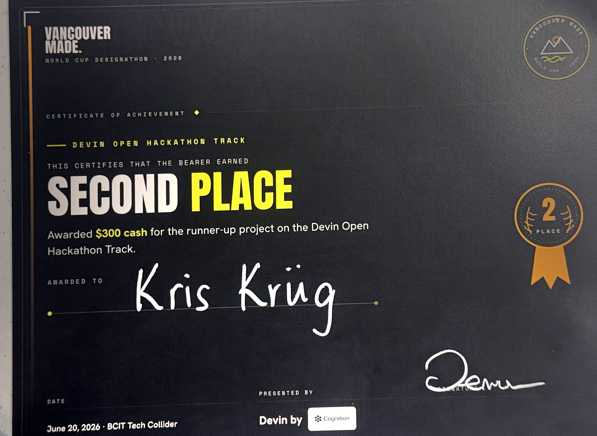
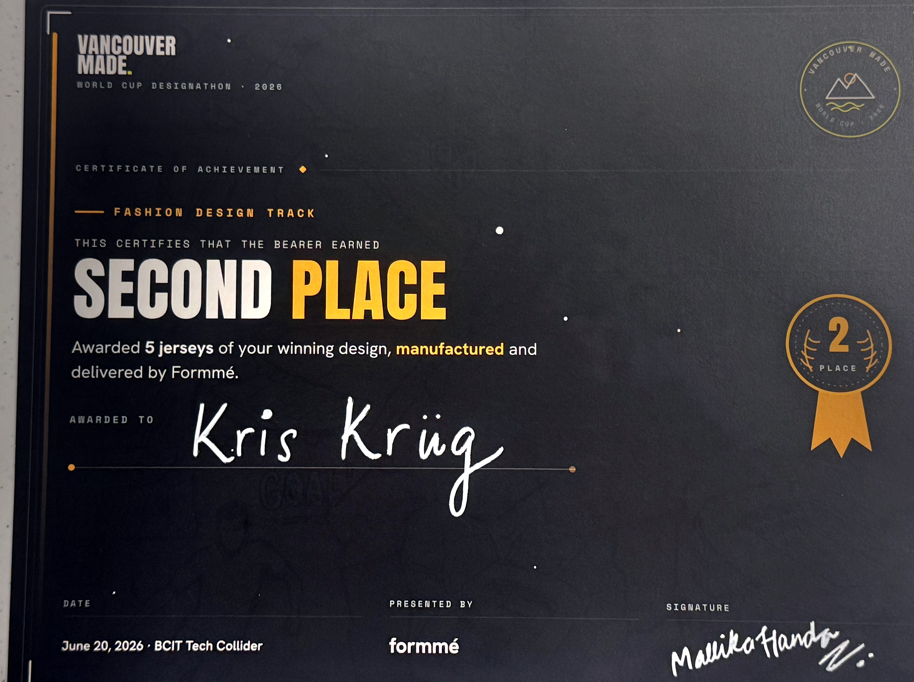
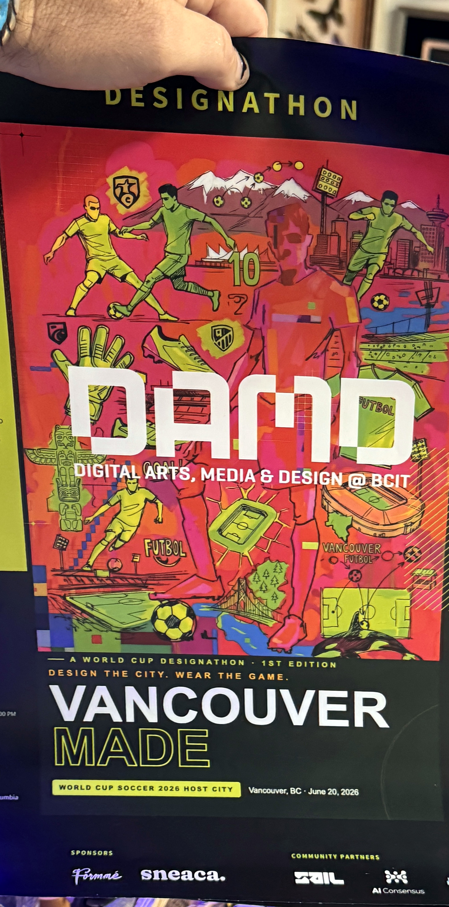

# Awards — MADE ON / Vancouver Made

**🥈🥈 Double silver — BCIT Tech Collider, 2026.**

| Track | Result | Field | Prize |
|-------|--------|-------|-------|
| **Devin Technical Hackathon** (dev track) | 🥈 **2nd place** | ~100 entrants | **$300** |
| **Formme Design Challenge** (the jersey) | 🥈 **2nd place** | ~50 entrants | **Formme produces 5 of the jerseys** |

The dev track recognized the **Receipts Engine** pipeline + the three live counter-spectacle
surfaces (mimic → invert → cite). The design track recognized the **NARDWUAR FC "Deep Cut"**
red Vancouver-tartan kit — research as the protest, the receipt as the weapon.

The design prize is production: **five of the kits get made.** Locking the final Nardwuar
design for that run is tracked in [#26](https://github.com/WalksWithASwagger/vancouver-made/issues/26).

## Certificates

The two Second Place certificates (cleaned up: perspective-corrected, squared, lighting flattened). Full-resolution source for reuse on the site, socials, and print.

## The event

**Vancouver Made: a World Cup Designathon and Hackathon** (1st edition). "Design the city. Wear the game."

- **When:** June 20 2026, 9:00 to 7:30
- **Where:** BCIT Tech Collider, 555 Seymour St, Vancouver, BC
- **Tracks:** Devin Open Hackathon · Formmé Fashion Design
- **Hosts:** Students@AI · Young Guns Studio. **Sponsors:** Devin by Cognition · Formmé
- **Event page:** https://luma.com/erjpeza4

_Event poster by Vancouver Made / DAMD @ BCIT, photographed at the event (cleaned up for the knowledge base)._

## Share assets

Generated by `scripts/build-social-cards.py` (Tartan-Paper palette, the Nardwuar kit, double-silver result):

- `public/og.jpg` — 1200x630 link/OG card, wired into `index.html`.
- `deliverables/awards/social/square-1080.jpg` — Instagram square.
- `deliverables/awards/social/story-1080x1920.jpg` — Instagram / Facebook story.
- `deliverables/awards/social/link-1200x630.jpg` — link card.

Live awards page: `/awards`.

---

*Recorded after the event. Designer: Kris Krüg · settler artist. The project survived a
multi-lane build, a site-wide redesign, and still placed twice.*
