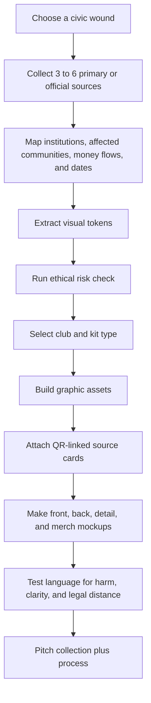

# ALLEY LEAGUE Protest Kit System for a Vancouver Counter-World Cup

## Executive summary

The most rigorous version of **ALLEY LEAGUE** is not a shock-merch collection. It is a **source-backed protest design system** that treats the football kit as a civic document: a wearable receipt for land, labour, policing, branding, housing, and racialized displacement. The collection should attack **institutions, policies, and profit structures**, not victims, grief, or Indigenous cultural forms that are not yours to use. That stance is not just moral positioning; it is the strongest design logic available in Vancouver’s actual context. Vancouver sits on the unceded territories of the Musqueam, Squamish, and Tsleil-Waututh Nations, and the City states plainly that “unceded” means the land was never legally ceded to the Crown. The National Inquiry into Missing and Murdered Indigenous Women and Girls gathered truths from more than 2,380 family members, survivors, experts, and Knowledge Keepers and issued 231 Calls for Justice directed at governments, institutions, industries, and all Canadians. citeturn14view1turn14view0

The collection is strongest when it is anchored in **documented local histories**. Vancouver’s own materials acknowledge that Hogan’s Alley was home to the city’s largest Black and African diaspora community and that this community was displaced over decades by city actions, culminating in the Georgia and Dunsmuir viaducts. The City’s Anti-Black Racism and Cultural Redress framework explicitly says the Hogan’s Alley Society MOU is meant to address city policies, plans, and services that contributed to that displacement. citeturn14view3turn15view4

It is also strongest when it names the event machine directly. Official City and provincial materials say Vancouver will host seven World Cup matches; the City projects **$320 million to $338 million** in core and essential costs, plus **$67 million to $74 million** for other public-sector services, while combined local and provincial safety and security costs are estimated at **about $242 million**. The City’s 2025 FIFA by-law and related materials also confirm temporary changes tied to safety, security, branding, and **brand protection** obligations, including controls on signage, advertising materials on streets, street vending, and street entertainment in event zones. citeturn14view5turn18view1turn15view3turn15view2turn17view1

That evidence points to a clear strategic recommendation. The **lead clubs** should be:

- **Pump & Dump FC** for Vancouver’s Howe Street, shell-company, speculative-mining, and pump-and-dump mythology.
- **Viaduct United** for Hogan’s Alley, Black displacement, urban renewal, and concrete-as-scar.
- **Security Theatre FC** for brand protection, restricted public space, credential culture, and event policing.
- **Host City / Ghost City** as the collection umbrella that connects all of the above.

The **highest-risk club** is **City That Looked Away** because the MMIWG context requires the most discipline. If you use it at all, it should stay cold, administrative, redacted, and institution-focused. No killer iconography. No victim cosplay. No red-hand shorthand unless Indigenous collaborators explicitly lead that choice. Respectful image-use and Indigenous visual-arts protocol guidance both emphasize relevance, consent, and respectful engagement; Vancouver’s own Human Rights Action Plan says the event requires additional support for vulnerable populations, including sex workers, women facing gender-based violence, and unhoused residents. citeturn14view10turn14view11turn21view1

## Research basis and assumptions

This report is grounded first in **primary and official sources**: the MMIWG Final Report and supplementary materials; City of Vancouver pages and council reports on land acknowledgement, Hogan’s Alley, Northeast False Creek, by-law changes, anti-Black cultural redress, and World Cup operations; provincial and host-city World Cup cost updates; BC Securities Commission and Investor.gov materials on pump-and-dump schemes; and Canadian federal textile-labelling requirements. Local reporting from **The Tyee** is used to capture civic criticism, especially around event-zone bylaws, displacement concerns, and competing narratives about “benefit” versus harm. citeturn14view0turn14view1turn14view3turn24view0turn15view3turn21view1turn14view7turn15view8turn23view0turn17view0turn17view1

A few design assumptions shape the recommendations. You did **not** specify a manufacturing budget, collaborator list, sales channel, or whether this remains a hackathon prototype versus a real commercial drop. So the system below assumes a **prototype-to-small-run pathway**: one hero kit per club, presentation-quality mockups, a merch system that can be printed quickly, and product rules that stay valid if a concept later becomes a sellable item. If garments are ultimately sold in Canada, fibre-content and dealer information labelling is mandatory; some textile products require permanent labels that remain affixed and legible for at least ten cleanings, while care instructions are voluntary but cannot be false or misleading. citeturn23view0

The historical and political context also imposes hard constraints. First, Vancouver’s own reconciliation and cultural-redress materials explicitly centre Musqueam, Squamish, Tsleil-Waututh, urban Indigenous communities, Black communities, and Hogan’s Alley Society in design and programming conversations for Northeast False Creek. Second, the host-city structure includes an MOU with the Nations for the World Cup, and the Host City Human Rights Action Plan says it was developed with subject-matter experts and community-serving organizations. Third, city documents confirm that the host committee must support FIFA’s brand-protection program. Taken together, those facts mean ALLEY LEAGUE should use **territorial truth, community history, redaction, maps, permits, receipts, and bureaucracy** as its visual raw material, while avoiding both Indigenous appropriation and lazy sponsor-logo copying. citeturn24view1turn15view7turn21view0turn15view2

The right visual field for this project is already sitting in the city: viaduct concrete, exchange-floor paper scraps, stadium control zones, fan-festival infrastructure, and traces of erased neighbourhoods. citeturn24view0turn15view5turn20view0turn17view1

iturn12image3turn10image0turn12image4turn12image8

## Club architecture comparison

The table below compares all nine candidate clubs as one coherent league. The “ethical risk” column is a design assessment, not a legal judgement. It reflects how easily a concept can slide from institutional critique into exploitation, stereotype, or aestheticized harm. The ranking is informed by the MMIWG inquiry, Indigenous protocols, respectful image-use guidance, the host-city human-rights plan, Hogan’s Alley redress work, and official World Cup by-law and brand-protection materials. citeturn14view0turn14view10turn14view11turn21view1turn15view3turn15view2turn14view3turn24view1

| Club concept | Thesis | Dominant metaphor | Palette direction | Hero merch | Ethical risk |
|---|---|---|---|---|---|
| **Host City / Ghost City** | The branded city erases the billed city | Receipt, redaction, vanished poster wall | Rain black, receipt white, civic grey, emergency red | Oversized invoice tote + source-card zine | Low to medium |
| **Pump & Dump FC** | Vancouver as shell-company ecosystem | Candlestick chart, boiler-room prospectus, shell org chart | OTC-pink, Howe-charcoal, copper, cash green | Fake share certificate + boiler-room scarf | Low |
| **Viaduct United** | Urban renewal built over Black life | Concrete slash across a street grid | Concrete grey, hazard yellow, Union black, archival cream | Folded street-map scarf + demolition pennant | Low |
| **City That Looked Away** | Institutional failure, not trauma merch | Redacted file, blind-spot camera, empty poster wall | Archive black, file-tab red, paper white | Redacted file folder + witness armband | High |
| **Number Five Orange** | Event city as transaction and spectacle | VIP laminate, wristband, service fee, marquee neon | Neon orange, vinyl black, dirty gold | Fake VIP pass + receipt-print wristband set | Medium to high |
| **Security Theatre FC** | Public space converted into controlled space | Accreditation badge, barricade, CCTV grid | Security blue, asphalt, warning yellow | Denied-access lanyard + closure flag | Low |
| **Rent Cheque Rovers** | Home city with no home game | Eviction notice, condo glass, lockbox | Notice cream, legal red, condo blue | Moving-box tote + lockbox keychain | Low |
| **False Creek False Promises** | Greenwashed waterfront legacy | Waterline map, condo reflection, washed-out legacy render | Tidal teal, glass blue, salt white, algae green | Reusable cup + drowned-skyline scarf | Medium |
| **Pigs at the Trough** | Public money feeds state-corporate greed | Piggy bank, trough, bullion, consultant buffet | Budget pink, municipal beige, bruised gold, black | Cracked piggy-bank pin + budget ledger poster | Medium |

On a **presentation-first** timeline, the most defensible release order is: **Host City / Ghost City** as umbrella; **Pump & Dump FC** as the sharpest Vancouver-specific intervention; **Viaduct United** as the morally strongest historical line; **Security Theatre FC** as the cleanest World Cup-specific critique. **Rent Cheque Rovers** and **False Creek False Promises** are strong secondary clubs. **City That Looked Away** should be treated as a research piece or quiet archive edition unless you have a very clear community-accountable reason for activating it. citeturn15view8turn20view0turn14view3turn24view0turn15view3turn17view0

## Design dachshund briefs

The design system works best if every club shares a **league logic** and then diverges through its own evidence set.

| System element | Recommended spec | Why it fits ALLEY LEAGUE |
|---|---|---|
| **League crest logic** | All clubs use one shield geometry with one “evidence cut” line | Creates a common league family without flattening the clubs |
| **League type system** | One condensed grotesk for names/numbers; one monospace for source metadata and back-neck text | Puts sportswear and record-keeping in the same visual sentence |
| **Trim language** | Every kit gets one “document edge”: tear line, docket tab, filing punch, permit stamp, or barricade stripe | Keeps the politics structural, not decorative |
| **Text treatments** | Use microtext, redactions, docket numbers, index tabs, warning bars, bylaws, permits, and route maps | These are source-backed forms of local power and administration |
| **Source-card hook** | Every club gets a QR-linked back-hem code and an inside-neck source ID | Makes the “show your process” criterion part of the garment |
| **Parody sponsor rule** | Never imitate FIFA or partner wordmarks; use original typography and commentary language only | City and host materials confirm active brand-protection obligations and restrictions on unauthorized commercial activity in event zones |
| **Indigenous-content rule** | Use territorial language, relation, and protocol; do not use generic “Indigenous-inspired” motifs or unrelated likenesses | City, UBC, and Indigenous protocol resources all push toward relevance, collaboration, and respectful engagement |
| **Victim-image rule** | No victim photos, family photos, sacred symbols, or unrelated Indigenous images without consent and contextual relevance | Respectful image-use guidance and MMIWG context make this non-negotiable |

citeturn15view3turn15view2turn14view10turn14view11turn21view0turn14view0

The next table gives each club a **token bank**, a **typography anchor**, and a **mock sponsor-parody copy bank**.

| Club | Visual token list | Typography anchor | Sponsor-parody copy bank |
|---|---|---|---|
| **Host City / Ghost City** | receipts, redactions, temporary signs, event maps, rain streaks, vanished posters, invoice stamps | municipal wayfinding + audit monospace | **CIVIC AMNESIA**, **OFFICIAL CITY / UNOFFICIAL COST**, **WELCOME THE WORLD / BILL THE PUBLIC** |
| **Pump & Dump FC** | candlestick charts, boiler-room scripts, shell diagrams, share certificates, mining claims, fax noise, penny-stock ticks | terminal monospace + press-release serif | **FORWARD-LOOKING STATEMENTS**, **EXIT LIQUIDITY**, **NUMBERED COMPANY ATHLETIC**, **BUY THE RUMOUR** |
| **Viaduct United** | street grids, overpass shadows, demolition notices, survey marks, lane paint, support columns, archival map fragments | road-sign grotesk + plan-set numerals | **URBAN RENEWAL KILLS**, **CONCRETE LEGACY**, **NO FREEWAY TO PARADISE** |
| **City That Looked Away** | blank poster fields, redacted case tabs, file numbers, CCTV blind spots, unanswered-call logs, witness markers | evidence-room sans + index typewriter | **CASE CLOSED?**, **LOOK AGAIN**, **WITNESS / NOT SPECTATOR** |
| **Number Five Orange** | wristbands, service fees, VIP laminates, marquee lettering, ticket stubs, motel keys, cover-charge stamps | nightlife marquee + thermal-receipt mono | **VIP ACCESS ONLY**, **EVERYTHING MUST GO**, **SERVICE FEE FC**, **PUBLIC LAND PRIVATE PROFIT** |
| **Security Theatre FC** | lanyards, barricade mesh, CCTV icons, route arrows, permit tape, drone pictograms, closure notices | accreditation sans + airport wayfinding | **AUTHORIZED PERSONNEL ONLY**, **PUBLIC SPACE NOT FOUND**, **SCREENED FOR ENTRY** |
| **Rent Cheque Rovers** | tenancy notices, condo grids, smart locks, presale ads, date stamps, legal boxes, key safes | legal-form sans + classifieds condensed | **LANDLORD FC**, **NO HOME GAME**, **THE CITY IS SOLD OUT** |
| **False Creek False Promises** | waterlines, condo reflections, park renders, leaf icons, shoreline plans, seawall arrows, ESG stamps | eco-brand humanist + engineering mono | **GREENWASH ATHLETIC**, **SUSTAINABLE EXTRACTION**, **LEGACY PENDING** |
| **Pigs at the Trough** | piggy banks, cutlery, budget ledgers, gold bars, handshake icons, trough silhouettes, consultant checklists | corporate grotesk + ledger numerals | **PUBLIC TROUGH PARTNERS**, **EAT THE BUDGET**, **OUR MASCOT IS DENIAL** |

The full “dachshund” matrix is below. It is intentionally concise and modular so a team can prototype quickly without losing conceptual rigour.

| Club | Home kit | Away kit | Third kit | Keeper kit | Limited kit |
|---|---|---|---|---|---|
| **Host City / Ghost City** | White base with faint receipt texture; chest reads as a clean civic kit from a distance, but up close becomes invoices, road notices, and consultation fragments | Asphalt-black with rain sheen and torn-poster texture; redaction bars replace stripes | “Source Code” edition built from QR blocks and microtext; best hackathon showpiece | Safety-orange or emergency-red with municipal alert language and closure arrows | “Ghost Wall” edition using blank poster silhouettes and paste-up edges |
| **Pump & Dump FC** | Ascending green/copper candlesticks across the torso; microtext built from hype language and fake investor decks | Crash-red away with vertical dump candles and shredded-certificate texture | “Shell Game” org-chart kit showing HoldCo/SubCo/LandCo/FanZoneCo | High-vis “Trading Halt” yellow-black with HALT / NEWS PENDING chest band | “Boiler Room Black” gala edition with prospectus footnotes and embossed ticker marks |
| **Viaduct United** | Concrete-grey diagonal scar over a ghosted Union–Prior–Main–Jackson grid | Dark away with lane-paint yellow details and archival foundation-line drawing | “Demolition Notice” kit using permit boxes, survey tape, and expropriation stamps | Rebar-black keeper jersey with seismic-line graphics and underpass shadows | “Nora Hendrix Block” cream-and-charcoal limited edition centered on the block footprint and commemorative numbering |
| **City That Looked Away** | Black-white administrative look with a blind CCTV circle over the heart | Paper-white away with file-tab red as the only accent; no figurative imagery | “Empty Poster Wall” third with layered blank rectangles and pull-tab tears | Steel-grey keeper kit using incident-log numerals and scan-line interference | Quiet memorial archive edition: redacted case tabs, no slogans larger than a whisper |
| **Number Five Orange** | Nuclear orange base with thermal-receipt striping and fake VIP laminate gloss language | Black-vinyl away with orange surcharge lines and service-fee symbols | “Champagne Room Economy” third in dirty gold and orange, intentionally tacky but legible | Neon-door-security keeper kit with wristband colours, flashlight cones, and queue-control tape | Ticket-stub limited edition packaged like a nightclub handbill rather than a sports drop |
| **Security Theatre FC** | Huge accreditation-card front; name field says UNINVITED PUBLIC | Barricade-blue away with mesh grids, route arrows, and screening icons | “Motorcade” third in suit-black with earpiece wire graphics and convoy stripes | Yellow-black “Do Not Cross” keeper kit with zone boundaries and closure notices | Laminated credential limited edition with detachable lanyard card and event-perimeter map insert |
| **Rent Cheque Rovers** | Cream legal-form base, date-stamp red, checkbox panels and tenancy-notice layout | Cold condo-glass blue away with window grids and FOR SALE microcopy | “Lockbox Camo” third built from smart locks, booking windows, and presale ads | Vacancy-red keeper kit with giant rental ledger numerals and arrears lines | “Move-Out Day” limited edition sold with folded notice poster and key-tag |
| **False Creek False Promises** | Tidal map lines wrap the torso; water texture built from receipts and skyline reflections | Sterile condo-blue away with washed-out luxury brochure gradients | “Legacy Render” third with ghosted planning render overlays and optimistic captions crossed out | Algae-green keeper kit with flood lines and shoreline contour marking | “Drowned Skyline” limited edition using foil map lines, seawall arrows, and a dead-serious sustainability insert |
| **Pigs at the Trough** | Soft piggy-bank pink with crack lines and falling-coin seams | Snout-camo away built from coins, handshakes, and procurement checklists | Gold-bar third with tacky bullion textures and black expense-ledger trim | “Budget Freeze” ice-grey keeper kit with frozen appropriation boxes and denied-request stamps | “Consultant Dinner” black-tie limited edition with receipt-backed lining and gilded trough pin |

The source-backed logic for the highest-priority clubs is unusually strong. **Pump & Dump FC** is not just a metaphor: Investor.gov and BCSC both define pump-and-dump schemes as hype-driven price manipulation, and BCSC reported in early 2026 that a Vancouver company and several Lower Mainland people were found to have carried out one. BC Studies and TMX confirm the city’s long-standing relationship with speculative exchange culture, and the old Vancouver Stock Exchange later became part of the Canadian Venture Exchange. citeturn14view8turn14view7turn15view8turn20view0turn14view9

**Viaduct United** is equally anchored. City and heritage sources say Hogan’s Alley was a Black cultural hub, that the community was displaced through city actions, and that the viaducts functioned as physical and visual barriers; current Northeast False Creek planning explicitly links reconnection, social housing, cultural redress, and the Hogan’s Alley block. citeturn14view3turn14view2turn24view0turn24view1

**Security Theatre FC** has very current relevance. The City’s by-law materials and related disclosures state that Vancouver must meet operations, safety, security, branding, and brand-protection obligations, and local reporting documents a two-kilometre downtown event zone and criticism around discriminatory enforcement, public-space restriction, and impacts on vulnerable people. citeturn15view3turn15view2turn17view1turn17view0

## Merch ecosystem and production notes

A strong ALLEY LEAGUE drop is not just shirts. It is an **ecosystem of evidence objects**: streetwear, matchwear, archive pieces, and intervention pieces. The merch should fall into three layers.

The first layer is **crowd gear**: scarf, hat, socks, jersey, captain’s armband, tote. These are legible from across a room. The second layer is **archive gear**: zines, trading cards, patch sheets, posters, fake share certificates, folded maps, permit sheets. These carry the research density and make the source trail visible. The third layer is **control-zone parody gear**: lanyards, denied-access credentials, VIP passes, closure notices, wristbands, “Know Before You Go” inserts, and matchday artifacts. That third layer is where the World Cup/event-capitalism critique really lands because official materials confirm the city’s emphasis on brand protection, controlled event areas, and managed spectator routes. citeturn15view2turn15view3turn17view1turn21view1

| Item | Core spec | Best clubs | What it should do |
|---|---|---|---|
| **Scarf** | Two-sided text + one side pattern | All clubs | Primary chant object; legible at distance |
| **Cap / bucket hat** | Minimal front mark, dense under-brim print | Pump & Dump, Security Theatre, Number Five Orange | Lets you hide the politics in the trim and reveal it up close |
| **Socks** | One slogan zone, one data zone | Pump & Dump, Rent Cheque Rovers, Viaduct United | Carries numbers, tickets, rent stamps, ticker fragments |
| **Lanyard + credential** | Full-control parody object | Security Theatre, Number Five Orange, Host City / Ghost City | Best way to critique access, exclusion, and accreditation culture |
| **Zine** | 12–24 pages, uncoated stock | Host City / Ghost City, Viaduct United, City That Looked Away | Houses the source cards, essays, maps, and ethics statement |
| **Trading cards** | Gloss front, matte research back | Pump & Dump, Pigs at the Trough | Turns systems into satirical player archetypes |
| **Matchday artifact** | One object per club | All clubs | Makes each club feel like a real institution with a paper trail |
| **Patch sheet** | Small woven or printed badges | All clubs | Easy add-on for jackets, bags, and pitch boards |
| **Pennant / flag** | Lightweight banner | Viaduct United, Security Theatre, Pump & Dump | Works as both merch and presentation prop |
| **Tote** | Large-format message surface | Host City / Ghost City, Rent Cheque Rovers | Carries invoice, notice, or map logic well |
| **Poster set** | A2 or tabloid street-poster style | All clubs | Best gallery/wall output for the hackathon pitch |
| **Sticker sheet** | 8–12 small icons + slogans | All clubs | Fast, cheap spread medium for the identity system |

On the production side, keep the workflow brutally practical. For garments, I would treat **all-over body graphics** as the core surface and reserve embroidered or woven detail for small crest/badge moments only. That recommendation is less about “premium” language and more about preserving the integrity of receipts, redactions, maps, and microtext. Archive objects should use **cheap, legible paper substrates** that feel like permits, menus, notices, or photocopied dossiers, not luxury art books. The merch should look like it leaked out of a city office, a boiler room, or a barricaded fan zone.

If this work moves beyond mockups and is **actually sold in Canada**, the practical compliance floor matters. The Competition Bureau states that textile fibre products must be labelled before sale; labels must show fibre content and dealer identity, and some products require permanent labels. The same guidance notes that care labelling is voluntary in Canada, but if used it cannot be false or misleading. It also notes that flags and pennants are exempt items, which is useful if you produce protest pennants as artifacts rather than garments. citeturn23view0

One more production note matters because of the event. The City’s FIFA by-law and CBC inquiry response make clear that host operations include preventing unauthorized commercial activity and applying brand-protection rules. My inference from that record is simple: **do not design this as counterfeit official merchandise** and do not assume you can vend it freely near controlled event zones. Build it first as criticism, portfolio, exhibition, classroom output, or off-site drop; if you later commercialize it, keep every mark distinct and every sponsor parody clearly your own graphic voice. citeturn15view2turn15view3

## Ethical guardrails and receipt-to-kit pipeline

The ethical rules for ALLEY LEAGUE should be explicit, not implied. The City’s own land-acknowledgement materials, the MMIWG inquiry, Indigenous visual-arts protocol resources, UBC’s respectful image-use guidance, Canada Council context briefs, and Vancouver’s host-city human-rights plan all point in the same direction: **relevance, consent, collaboration, and accountability** matter more than visual impact. Vancouver’s HRAP also names accessibility, gender-based violence, sex worker safety, outreach for vulnerable populations, and Indigenous partnership as live event issues. That means some concepts are viable only if they stay structural and do not turn lived harm into stylized content. citeturn14view1turn14view0turn14view11turn14view10turn15view0turn15view1turn21view1

| Red line | Why it fails | Safer move |
|---|---|---|
| Using generic “Indigenous-inspired” patterns or symbolic shorthand you did not inherit or co-create | Violates the report’s anti-colonial premise and ignores protocol guidance | Use territorial truth, governance language, maps, and relation; if Indigenous visual language is essential, bring in Indigenous collaborators and credit them |
| Making a serial-killer or victim-centred MMIWG kit | Re-centres perpetrators or aestheticizes grief | Keep the critique on institutions: redactions, blind spots, file systems, 231 Calls for Justice, missing implementation |
| Treating Number Five Orange as sex-work caricature | Punches down and fights the wrong target | Critique extraction, VIP culture, service fees, nightlife capitalism, hotel profiteering, and event spectacle instead |
| Copying a living Vancouver artist’s signature hand | Turns critique into style theft | Use an **alley-expressionist** brief: wet plywood, concrete, receipt paper, marker corrections, torn signage; cite influence in the deck without imitating the hand |
| Copying FIFA wordmarks, emblems, or sponsor dress | Triggers the exact brand-protection system you are critiquing | Build a parallel identity system with original crest geometry and sponsor-parody language |
| Using unrelated Indigenous faces or community photos as moodboard material | UBC guidance explicitly says images should be clearly related to the subject and used with consent | Use place, materials, documents, abstracted systems, and credited collaborator portraits only when actually relevant |

The reproducible part of the project is the **receipt-to-kit pipeline**. This is the hackathon edge: a design method that can be run again, not just one clever jersey.



A useful operating template is:

| Pipeline stage | Deliverable |
|---|---|
| Source intake | 3–6 links, one sentence each, one internal note on why they matter |
| Harm map | Institution, public cost, affected communities, event mechanism, spatial footprint |
| Token extraction | 8–15 tokens: colours, forms, symbols, dates, map fragments, terms, document shapes |
| Risk check | Appropriation risk, victim-centering risk, legal/brand-confusion risk, community accountability risk |
| Kit build | Front, back, sleeve, collar, hem, badges, number logic |
| Merch build | One hero object, one archive object, one intervention object |
| Source-link layer | QR destination page + one 100-word source-card summary |
| Review | Would a harmed community read this as analysis or appropriation? If unclear, rework |

The QR-linked **source-card template** should be brutally plain. Do not bury the source. Do not make it pretty before it is legible.

```text
ALLEY LEAGUE SOURCE CARD

Card ID:
Club:
Kit / Merch item:
Claim:
Why this is on the garment:
Primary source:
Source type:
Date:
Institution named:
Affected communities:
Key fact:
Short excerpt:
Ethical note:
Further reading:
```

Example QR targets for mockups can stay neutral and internal:

```text
AL-PD-001  /cards/pump-and-dump/howe-street-shell-game
AL-VU-003  /cards/viaduct-united/hogans-alley-displacement
AL-ST-002  /cards/security-theatre/event-zone-brand-protection
AL-HG-004  /cards/host-city-ghost-city/world-cup-public-costs
```

For the actual source cards, keep the copy anchored in the record. A **Pump & Dump** card can cite Investor.gov plus BCSC’s 2026 finding. A **Viaduct United** card can cite the City, Vancouver Heritage Foundation, and the anti-Black cultural-redress memo. A **Security Theatre** card can cite the FIFA by-law, the CBC inquiry release, and local reporting on the two-kilometre zone. A **Host City / Ghost City** card can pair cost projections with event-zone powers and host-city rhetoric about long-term benefits. citeturn14view8turn15view8turn14view3turn14view2turn15view4turn15view3turn15view2turn17view1turn14view5turn14view6

## Pitch script and suggested visuals

A clean **60-second pitch**:

> We were asked to design a Vancouver World Cup kit. Most kits turn a city into a logo. **ALLEY LEAGUE** turns it into evidence.
>
> This is a protest-oriented football collection built from primary sources about Vancouver: unceded territory, Hogan’s Alley displacement, World Cup public costs, event-zone bylaws, brand protection, housing extraction, and the city’s own human-rights commitments.
>
> Each club attacks an institution, not a victim. **Pump & Dump FC** targets Vancouver’s shell-game finance culture. **Viaduct United** wears Black displacement as a concrete scar. **Security Theatre FC** turns accreditation and barricades into sportswear. **Host City / Ghost City** is the umbrella: official celebration on the front, public invoice underneath.
>
> The novelty is not just the image. It is the system. We built a **receipt-to-kit pipeline** that turns documents, maps, dates, and policy language into a reproducible design method. Every major graphic links to a QR source card. Every garment has a paper trail.
>
> This is not anti-football. It is anti-amnesia.

The mockup set should be just as disciplined as the concepts:

| Suggested visual | What to show |
|---|---|
| **Hero flat-lay** | Front and back of one flagship kit on raw concrete or photocopy paper |
| **Detail crop sheet** | Collar text, hem QR, sleeve patch, number texture, source ID |
| **Merch grid** | Scarf, credential, zine, sticker sheet, matchday artifact in one overhead shot |
| **Street poster wall** | Nine clubs as one fake league lineup, each with a one-line thesis |
| **Source-card screen** | Phone mockup showing the QR destination and source summary |
| **Artifact close-up** | Fake share certificate, denied-access pass, folded notice, demolition pennant |
| **Context panel** | Simple board pairing 1–2 cited facts with 1–2 extracted visual tokens |

The best final presentation is **one flagship club fully resolved**, **two secondary clubs clearly systematized**, and **the whole league shown as a repeatable framework**. For that, I would put **Pump & Dump FC** on stage, flank it with **Viaduct United** and **Security Theatre FC**, and use **Host City / Ghost City** as the title architecture for the entire deck. That is the sharpest balance of local specificity, high design mileage, and low exploitation risk. citeturn15view8turn14view3turn24view0turn15view3turn17view1m
